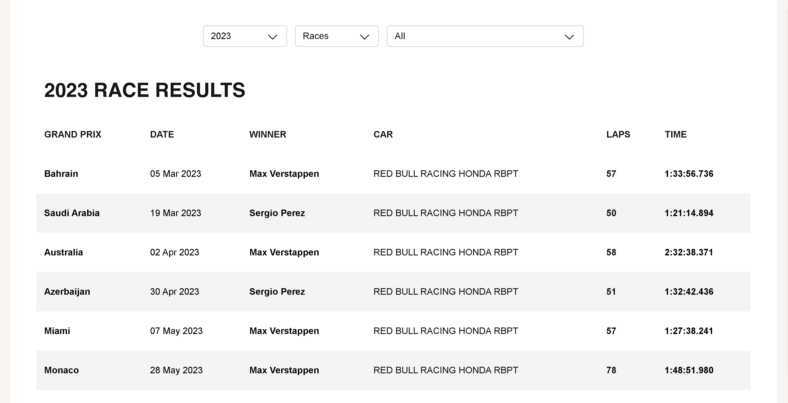
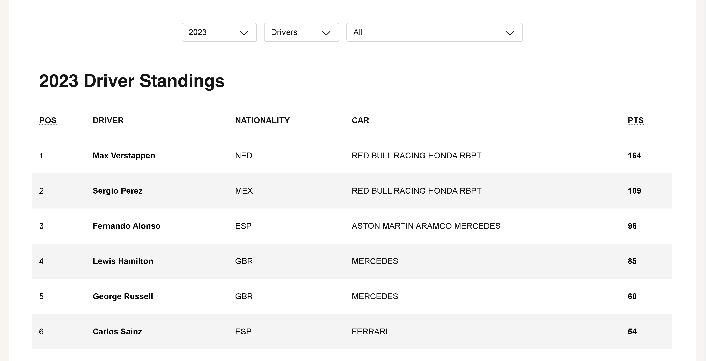
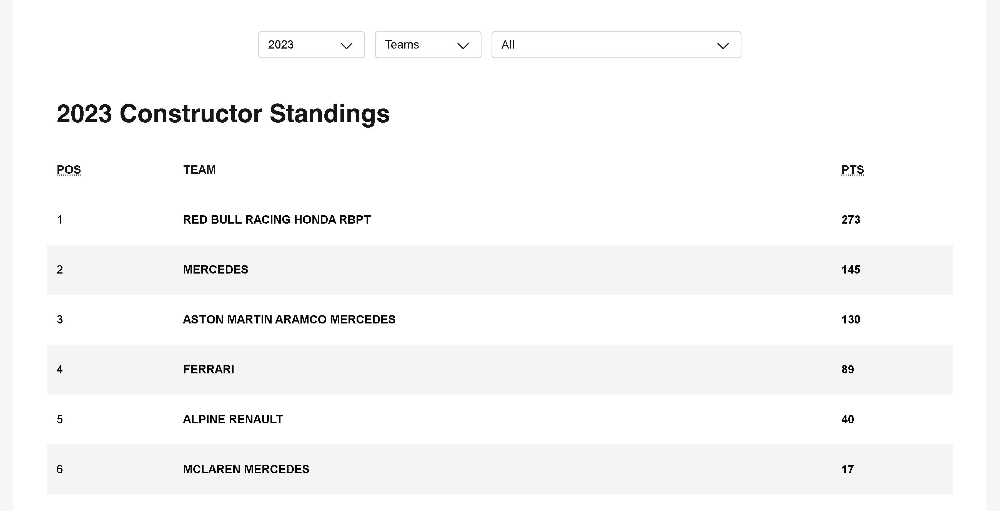

# React App with Formula 1 Race Results using TypeScript

This app uses React Typescript to display content crawled from the F1 racing results at RACE RESULTS (formula1.com). 

By connecting to this API to retrieve the data.

https://formula1-api-production.up.railway.app/api/

## Features
- List the race results by year, driver.
- List the results of the drivers leading in each race or the results of one driver across all races
- List the results of the participating teams, the results of one team across all races.

## Preview - [Live Demo](https://storied-profiterole-bc275d.netlify.app/)




## Run locally

1. Fork the repo in your account and then clone it as below.

```
git clone git@github.com:hungibninc/formular1-web.git
cd formular1-web
```

2. Install dependencies

```
yarn install
```

3. Run application.

```
yarn dev
```